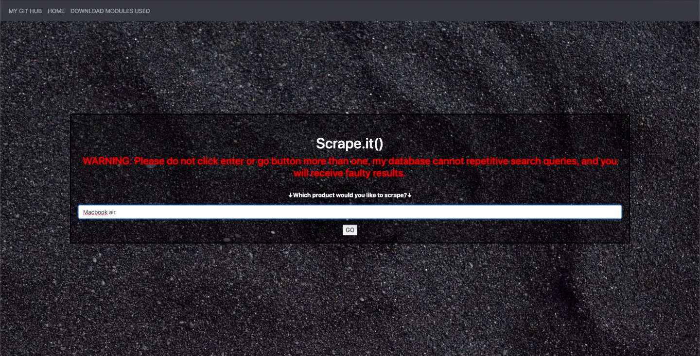
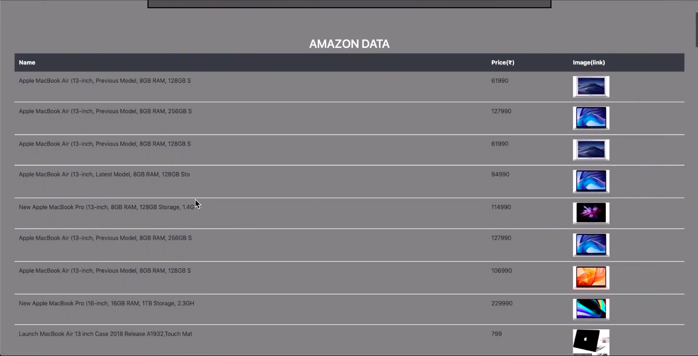
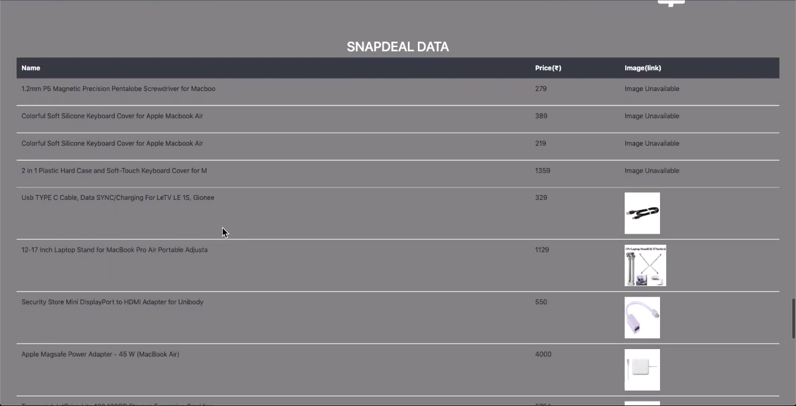
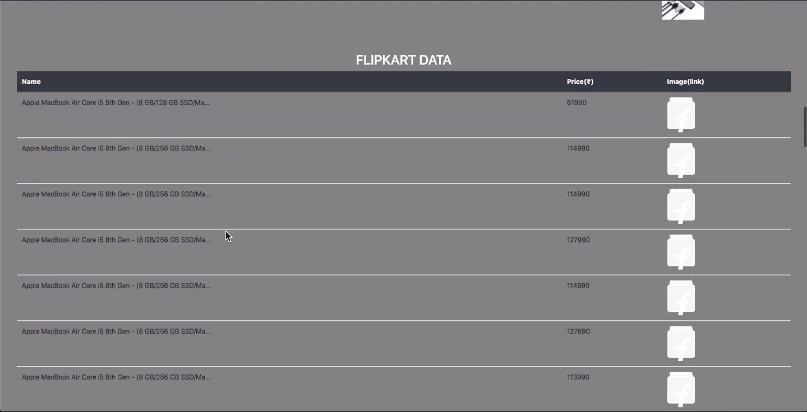

# PersonalProject2019

<h2 align='center'><strong>E-Commerce Web Scraper</strong></h2>

<em>Application link taken down, due to completion of project in 2019</em>

E-Commerce websites supported:
<ul type='square'>
  <li>Amazon(IN)</li>
  <li>Flipkart</li>
  <li>Snapdeal</li>
</ul>
 
This website enables the users to:
<ol type='1'>
  <li>Search for any product available either on Amazon, Flipkart or Snapdeal</li>
  <li>Compare the product price, picture and quality of products betwee Amazon, Flipkart and Snapdeal</li>
  <li>Make reliable decisions on the right product for purchase</li>
  <li>Save money by making wise purchases</li>
</ol>
 
This web application utilizes:
<ul type='square'>
  <li>Python flask as the backend --> <a href='main.py'>main.py</a></li>
  <li>Python modules requests and BeautifulSoup4 as the scraping tool for product information from all three websites --> <a href='main.py'>main.py (specific functions)</a></li>
  <li>HTML and CSS as front end --> <a href='Templates/index.html'>index.html (search page)</a> & <a href='Templates/result.html'>result.html (results page)</a></li>
</ul>
 
Screenshots of application working:

